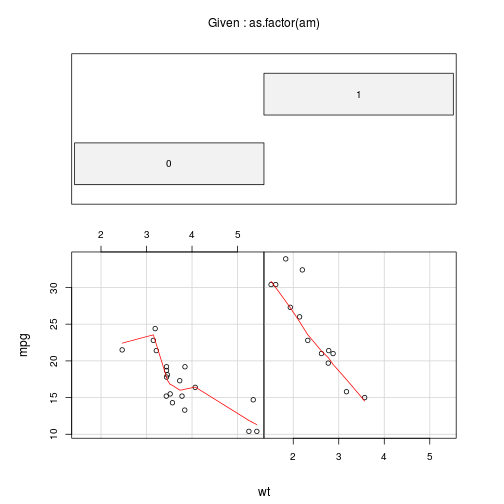

## Motivation

 I was working on my project on regression models course. In this course we were asked to find out if automatic or manual transmission has any correlation to mpg (miles per galon) metric. we were supposed to use mtcars data provided by R. While doing that project I thought that it would be nice if we could explore correlation between two variables give another variable as a factor.

This app helps us exploring mtcars data and correlations between various parameters listed in it. You can choose X axis paramater, Y axis parameter and a factor parameter from the list of mtcars column names. The list is given in left side bar for easy reference. Graph is responsive, whenever you change any of these three parameters, it refreshes plots in main window. This should be a handy tool in exploring correlations in mtcars database.

In coming slides I will explain how it can be useful in the context of finding correlations.

--- 
## Beginning Exploration

We can begin our exploration by plotting all pairs of metric available in the data to see broad correlations.

 

---

## Finding if two parameters are independent

checking if wt and am are independent or not.

 

--- 

### Further exploration has 11 x 10 x 9 possibilities

This simple exploratory analysis has huge number of combinations. We may want to choose a couple of those while evaluating some regression models. Doing it manually becomes a little cumbersome. So I created this shinyapp where you can change X, Y or factor parameter and see corresponding charts instantly. 

URL of this app is as follows

http://indramani.shinyapps.io/mtcarsApp

I hope you will like the utility of this concept and it is a useful automation if you want to explore mtcars data. 

Thank you.

